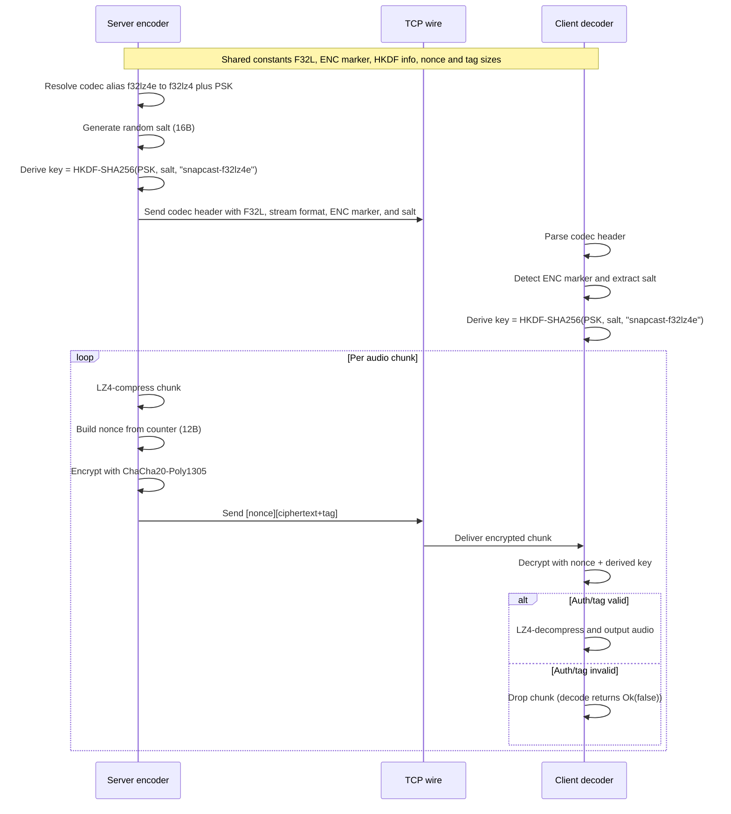
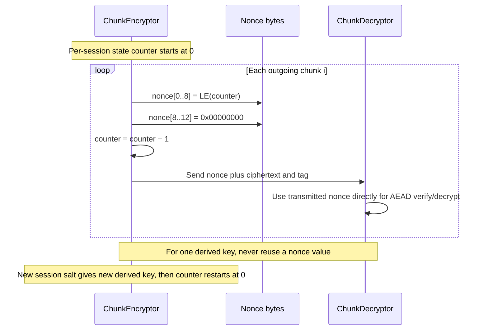

# Encryption in snapcast-rs (server + client)

This document explains the **audio-stream encryption path** used by snapcast-rs for `f32lz4e`.

It covers:
- server-side encryption
- client-side decryption
- wire/header format
- key derivation and nonce strategy
- configuration points

It does **not** describe TLS transport or control-API token auth.

---

## 1) What is encrypted

Encryption is used for the `f32lz4` audio codec when configured via the alias `f32lz4e`:

- codec alias constant: [`CODEC_F32LZ4_ENCRYPTED_ALIAS`](/opt/data/snapcast-rs/crates/snapcast-proto/src/lib.rs:84)
- resolved real codec: `f32lz4`
- optional PSK: [`DEFAULT_ENCRYPTION_PSK`](/opt/data/snapcast-rs/crates/snapcast-proto/src/lib.rs:91)

The encrypted payload is the **LZ4-compressed chunk bytes** (not raw PCM/f32 directly on wire in this mode).

---

## 2) Shared wire/crypto contract

Server and client share constants from [`f32lz4.rs`](/opt/data/snapcast-rs/crates/snapcast-proto/src/f32lz4.rs):

- base header magic: `F32L`
- encrypted marker: `ENC\0`
- salt length: 16 bytes
- nonce length: 12 bytes
- tag length: 16 bytes
- key length: 32 bytes
- HKDF info string: `snapcast-f32lz4e`

Encrypted codec header layout:

1. base f32lz4 header (`F32L` + rate/channels/bits)
2. `ENC\0`
3. 16-byte salt

Per encrypted chunk layout:

1. 12-byte nonce
2. ciphertext + 16-byte Poly1305 tag

### Sequence diagram

### Nonce lifecycle (compact)

---

## 3) Server-side flow

Relevant implementation:
- encoder selection: [`encoder/mod.rs`](/opt/data/snapcast-rs/crates/snapcast-server/src/encoder/mod.rs:75)
- f32lz4 encoder: [`encoder/f32lz4.rs`](/opt/data/snapcast-rs/crates/snapcast-server/src/encoder/f32lz4.rs:57)
- crypto primitive: [`crypto.rs`](/opt/data/snapcast-rs/crates/snapcast-server/src/crypto.rs:30)

Flow:

1. Server chooses codec `f32lz4`.
2. If `encryption_psk` is set, encoder calls `with_encryption(psk)`.
3. `with_encryption`:
   - generates random salt (16 bytes),
   - appends `ENC\0 + salt` to codec header,
   - builds a `ChunkEncryptor`.
4. For each chunk:
   - LZ4 compresses chunk bytes,
   - encrypts compressed bytes with ChaCha20-Poly1305,
   - prepends nonce.

Key derivation:
- HKDF-SHA256(psk, salt, info=`snapcast-f32lz4e`) -> 32-byte AEAD key.

Nonce strategy:
- 12-byte nonce = `[counter_le_u64][0,0,0,0]`
- counter increments per chunk for an encryptor instance.

---

## 4) Client-side flow

Relevant implementation:
- decoder init/use: [`decoder/f32lz4.rs`](/opt/data/snapcast-rs/crates/snapcast-client/src/decoder/f32lz4.rs:44)
- decryptor: [`crypto.rs`](/opt/data/snapcast-rs/crates/snapcast-client/src/crypto.rs:18)
- decoder wiring in controller: [`controller.rs`](/opt/data/snapcast-rs/crates/snapcast-client/src/controller.rs:344)

Flow:

1. Client receives codec header.
2. Decoder checks for `ENC\0` marker after base header.
3. If marker exists:
   - extracts salt,
   - requires `encryption_psk`,
   - constructs decryptor with same HKDF derivation as server.
4. For each incoming chunk:
   - decrypts `[nonce][ciphertext+tag]`,
   - on auth failure: chunk is dropped (`decode` returns `Ok(false)`),
   - on success: LZ4-decompresses to audio bytes.

If encryption marker is present but no PSK is configured, header setup fails.

---

## 5) Config entry points

### snapserver-rs binary

Config/CLI handling is in [`config.rs`](/opt/data/snapcast-rs/crates/snapserver-rs/src/config.rs:249):

- `codec = f32lz4e` is rewritten to `f32lz4`.
- if no explicit `encryption_psk`, default PSK is applied.

CLI fields (binary):
- codec option in [`main.rs`](/opt/data/snapcast-rs/crates/snapserver-rs/src/main.rs:67)
- encryption PSK option in [`main.rs`](/opt/data/snapcast-rs/crates/snapserver-rs/src/main.rs:75)

### snapclient-rs binary

CLI encryption option:
- [`cli.rs`](/opt/data/snapcast-rs/crates/snapclient-rs/src/cli.rs:91)

Binary currently passes:
- provided `--encryption-psk`, or
- default PSK fallback
in [`main.rs`](/opt/data/snapcast-rs/crates/snapclient-rs/src/main.rs:74).

### Embeddable crates

- server PSK: [`ServerConfig::encryption_psk`](/opt/data/snapcast-rs/crates/snapcast-server/src/lib.rs:452)
- client PSK: [`ClientConfig::encryption_psk`](/opt/data/snapcast-rs/crates/snapcast-client/src/lib.rs:180)

---

## 6) Security properties and limitations

What this gives:
- confidentiality of chunk payloads on wire
- authenticity/integrity per chunk via Poly1305 tag

> **Security guidance (production):** always set an explicit, strong `encryption_psk` on both server and client.  
> Do not rely on the built-in [`DEFAULT_ENCRYPTION_PSK`](/opt/data/snapcast-rs/crates/snapcast-proto/src/lib.rs:91), which is intended for convenience/testing and is shared/public in source.

What it does not automatically provide:
- transport identity/authentication (that is separate: TLS/control auth)
- replay-window tracking/stateful anti-replay logic
- key rotation policy management

Operational note:
- nonce uniqueness is tied to per-session counter + per-session salt/key derivation.
- avoid reusing the same key/nonce pair across sessions/chunks.
